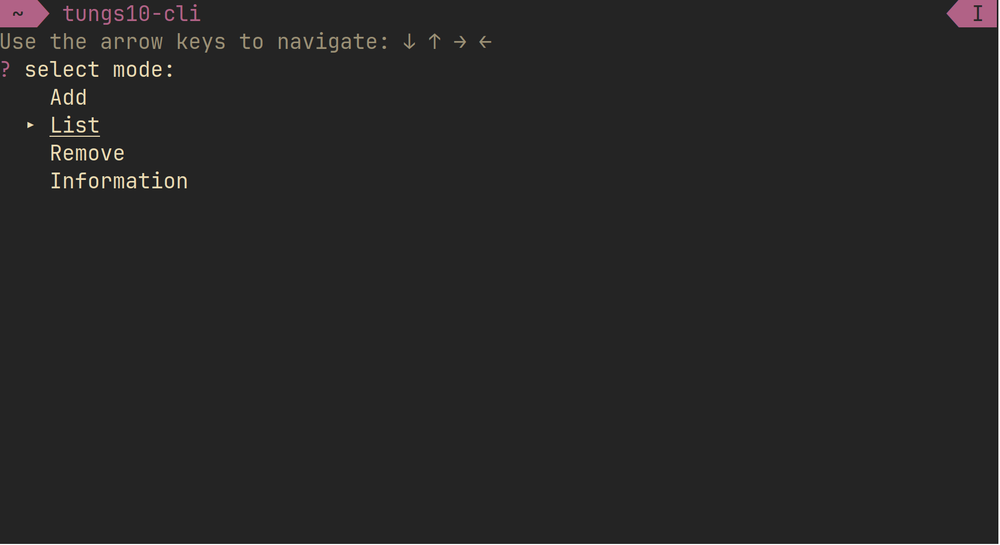

# Tungs10 CLI
tungs10-cli is a simple and interactive command line password manager.

# Installation

Run following commands to install tungs10-cli.
```
git clone https://github.com/ryozk/tungs10-cli.git
cd tungs10-cli
chmod +x tungs10-cli
./install.sh
```
When you finished running last command and as you see, you have to add install directory to your path.

You can do it by running the following command.

**zsh:**
```
echo "export PATH=$PATH:/path/to/directory >> ~/.zshrc"
```
**bash:**
```
echo "export PATH=$PATH:/path/to/directory >> ~/.bashrc"
```
**fish**
```
fish_add_path -U /path/to/directory
```
# Usage
You can use this tool with following command.
```
tungs10-cli
```


# Security problems
* **Despite using AES-CBC, the ciphertext that saves the same character string for the same user matches.**
  
    Cause of this problem is very simple. Using only an initial vector and a key that is generated from the password per user causes this. It's not a critical problem to expose your credentials directly but, it's not good for security clearly so, I'll fix this problem when I have a free time.


Please contact me if you find a security problem or bug.

email: ryoozaki@proton.me


